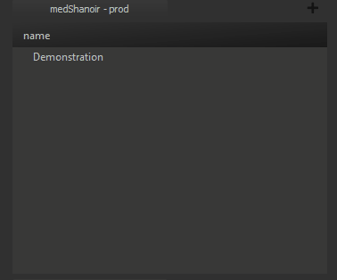
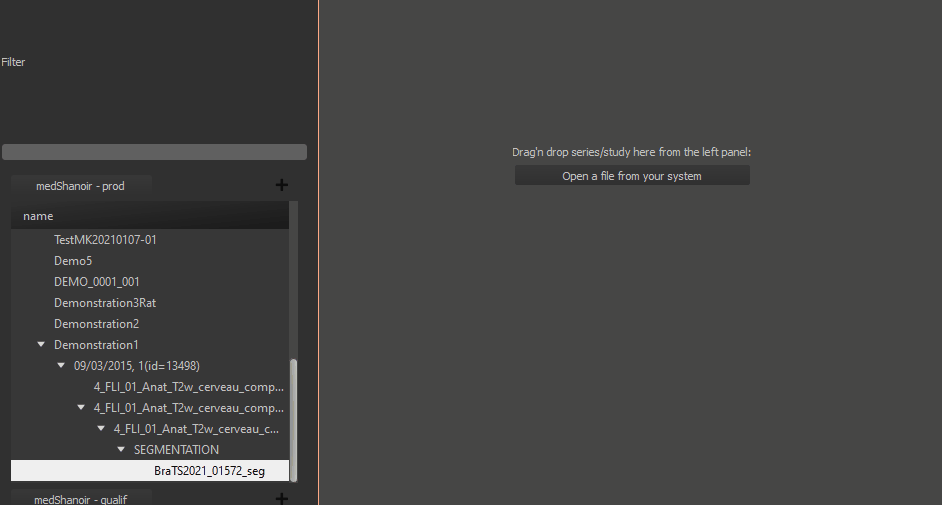
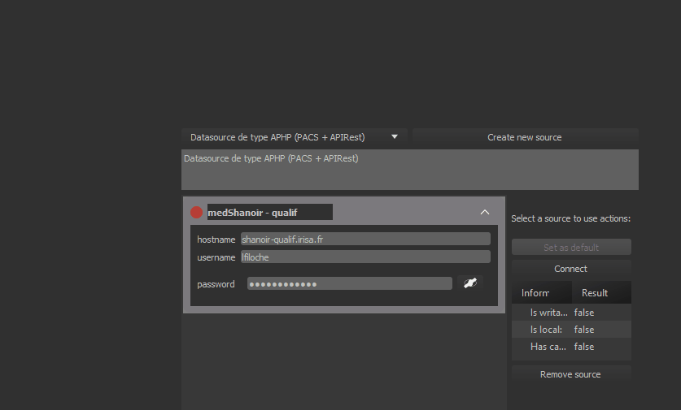

# medShanoir : a medInria plugin for shanoir

This plugin aims to connect a [shanoir NG](https://github.com/fli-iam/shanoir-ng) plateform to medInria.

## Features

### Visible features

* **Retrieve projects** and their tree-view

* **Load files** directly into medInria

* **Create** processing datasets

* **Upload** processed datasets

* **Connect** to several shanoir servers at the same time

### Background features

* **Automated deletions** of the datasets once they are downloaded and loaded in medInria.

* **Automated unzipping** of the downloaded datasets using the system's default decompressor.

* **Asynchronous processes** on heavy operations, such as data uploading and downloading.

* **Encryption** of each plugin instance's password.

### Demos in Gifs

<details>
<summary>Tree-view Retrieving</summary>



</details>

<details>
<summary>Dataset loading</summary>



</details>

<details>
<summary>Multi server connexion</summary>



</details>

## Dependencies

This plugin doesn't use any additional dependencies beyond the pre-existing ones from medInria.
Likewise the rest of the project, it is written in C++, with the [Qt5 framework](https://www.qt.io/download-qt-installer-oss). The compilation is done with [CMake](https://cmake.org/download/).

## Structure

```bash
medShanoir
├── doc                                    # Documentation
│   └── config.doxygen
├── internal                               # Plugin's logic
│   ├── Authenticator.cpp
│   ├── Authenticator.h                    # Authentication tasks
│   ├── FileHelper.h                       # File manipulation functions
│   ├── JsonHelper.h                       # JSon manipulation functions
│   ├── Levels.h                           # Shanoir's tree-view elements
│   ├── RequestPreparation.h               # Request writing functions 
│   ├── LocalInfo.cpp                     
│   ├── LocalInfo.h                        # plugin's instance information
│   ├── RequestManager.cpp
│   ├── RequestManager.h                   # interactions with the network
│   ├── AsyncNetwork.cpp                   
│   ├── AsyncNetwork.h                     # Asynchronous tasks
│   ├── SyncNetwork.cpp
│   └── SyncNetwork.h                      # Synchronous tasks
├── medShanoir.cpp
├── medShanoir.h                           # medAbstractSource implementation
├── medShanoirPlugin.cpp
├── medShanoirPlugin.h                     # Export info
├── medShanoirPlugin.json                  # Version info
├── medShanoirPluginExport.h               # Export macros
└── CMakeLists.txt                         # Compilation 
```

## Documentation

Generate automatic documentation with doxygen & graphviz.

```bash
# On Debian systems, install those tools with 
sudo apt install doxygen
sudo apt install graphviz
# then place yourself in the doc folder and run
doxygen config.doxygen
```
